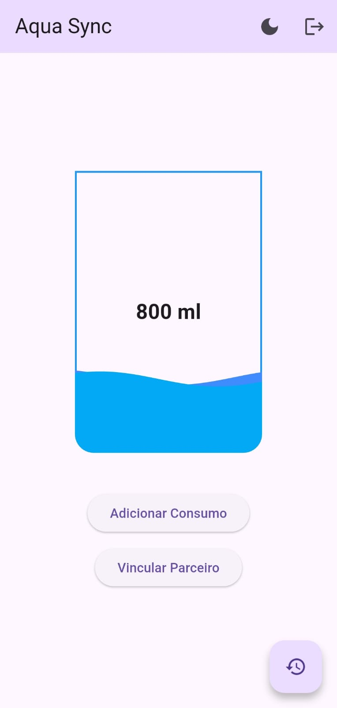

# Aqua Sync

Aqua Sync é um aplicativo para **registrar e acompanhar a ingestão de água entre amigos**, ajudando a manter o hábito de se hidratar de forma divertida e colaborativa.

---

## Funcionalidades

- Registrar a quantidade de água consumida diariamente.  
- Visualizar o progresso diário de ingestão de água.  
- Vincular parceiros para acompanhar o consumo em grupo.  
- Interface simples e intuitiva.

---

## Tela do App

---

## Download do APK

Você pode baixar a versão de instalação do app no GitHub Releases:  
[Baixar APK](https://github.com/LuizMiguel4444/AquaSync/releases/tag/v1.0.0)

---

## Como usar

1. Instale o APK no seu dispositivo Android.  
2. Abra o aplicativo e registre seu consumo de água diário.  
3. Adicione um parceiro para acompanhar o consumo em conjunto.  
4. Utilize o histórico para monitorar sua evolução ao longo do tempo.

---

## Tecnologias

- Flutter (Android)  
- Dart  
- GitHub para versionamento e distribuição do APK
- Google FireBase

---

## Contribuição

Contribuições são bem-vindas!  
Para contribuir, faça um fork do repositório, crie uma branch com suas alterações e envie um pull request.

---

## Licença

Este projeto está sob a licença MIT.  
